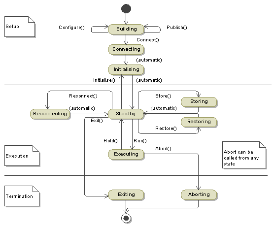

Module|Simphonie|Méthode vides|Implémentation à revoir|Priorité
--|--|--|--|--
|kern|Publication|· Unpublish · GetOperations|• PublishProperty : questionning parent of property • PublishArray (return IPublication) • PublishStructure (return IPublication) • PublishStructure (return IPublication) • PublishOperation (return IPublication) • PublishField (return IPublication) • Delete|4|
|kern|ExInvalidParameterValue||ExInvalidParameterValue : add value in message (for each type)|OK|
|kern|Operation| CreateRequest : ?| DeleteRequest : check if request exist|4|
|kern|Simulator|• Abort • Exit • GetFactories • Hold (multi-threaded) • Restore : deserialize models states from file|• Reconnect : Besoin de changer l'état du simulateur? • configure : recursive call on childs • connect : appels récursif sur les enfant • CreateInstance : add new instance in a container when the parent is set? Check if it's needed to pulish/configure/connect immediately after adding component • Simulator : get simulator in resolver|1|
|kern|TypeRegistry|• AddEnumerationType : PTK_Int64 not useable, issue with SMP interface definition|• TypeRegistry : missing type • AddFloatType : Ajouter sous-classe pour stocker min, max, unit … • AddIntegerType : Ajouter sous-classe pour stocker min, max, unit ... • AddArrayType • AddClassType : verfier classtype|2|
|kern|PublishOperation|PublishParameter||3|
|kern|ExTypeAlreadyRegistered||ExTypeAlreadyRegistered : display uuid of type|3|
|kern|StructureType||setup : dirty method to addFields|1|
|kern|Request||SetReturnValue : implement Smp::InvalidReturnValue|OK|
|kern|EventManager||Subscribe : unsafe thread method|3|
|kern|Scheduler||schedule : questionning entrypoint change its own simulation time • CreateInstance : Gérer les noms invalid, Smp::InvalidObjectName • dépendance Scheduler - TimeKeeper|2|
|kern|LinkRegistry|ILinkingComponent à appeler pour supprimer les links||4|
|kern|Persist|• Store • Restore||4|
|kern|Resolver|• GetEntryPoint appelé par  getasbolute • gestion data ou tableau||1|
|kern|Factory||CreateInstance : Gérer les noms invalid, Smp::InvalidObjectName|OK|
|kern|TimeKeeper||time management in public should be manage by a simulation|2|
|smpdk|Uuid||check if uuid decryption is not breakable • faciliter création à partir string|1|
|smpdk|Component||Disconnect() : not complete (deallocation)|1|
|smpdk|AnySimple||Opérateur ostream|OK|
|smpdk|Object||checkName (questioning forbidden words) questionning private/protected functions|4|
|sys|ChronoTool||schedule statistics : measure execution time|3|
|sys|Logger||add enum log level|2|
|umdl|SysTimeSynchro||nanosec not compiling, ms/1000 is used|4|

# Publish/Connect/Config

*Fonctions non implémentées*
### 5.2.12.2 IPublication interface
Ensemble des fonctions:
- PublishArray
- PublishStructure
- PublishOperation
- PublishField
 Retournent un pointeur vers une IPublication*, cela permet de publier chacun des éléments contenus.

> The IPublication PublishArray/Structure/Operation/Field method shall allow publishing a structure by allowing each child element to be published individually
> - NOTE 1 The returned IPublication interface allows callers of PublishStructure to publish each element of the struct individually. 
> - NOTE 2 See clause 5.2.12.2 for details on how to publish each element individually. 

**Page 63-64** | **Page 98-99**

*Fonctions implémentées*
## 5.3.7 Simulator
1. Le lancement de la simulation depuis le "Simulator" se fait dans l'ordre suivant:
    
    > The ISimulator interface shall be used to setup the simulation as per the following procedure:  
    >1. First the Publish method is called; 
    >2. After returning from the Publish call, the Configure method is called; 
    >3. After returning from the Configure method, the Connect method is called; 
    >4. After returning from the Connect method, the Initialise method is called.

*Fonctions non implémentées*

2. La méthode Punblish() du simulator appel toute récurcivement les méthodes Publish() de tous les services et modèles.

    > The ISimulator Publish method shall call the Publish() method of all service and model instances in the component hierarchy that are in Created state within the simulation
    >    1. After returning from the “SMP_EnterPublishing” global event, it traverses through the "Service"container of the simulator, as follows: 
    >        * It calls the Publish() operation of each component in CSK_Created state; 
    >        * After calling Publish() on a service, it calls Publish() immediately on all its child components recursively.  
    >    2. After completing the “Service” container, it traverses through the "Models"container of the simulator as follows:
    >        * It calls the Publish() operation of each component in CSK_Created state; 
    >        * After calling Publish on a model, it calls Publish immediately on all its child components recursively.

**Page 83-84-85**

# Simphonie / SMPC LifeCycle
La quasi totalité du cycle de vie est gérée par Simulator.

## Storing
Définition de la méthode Store() :
>In Storing state, the simulation environment first stores the values of all fields published with the State attribute to storage (typically a file). Afterwards, the Store() method of all components (Models and Services) implementing the optional IPersist interface is called, to allow custom storing of additional information. 
Méthode de sauvegarde meta data XML des composants **page 32** .

## Restoring
Définition méthode Restore():
>In Restoring state, the simulation environment first restores the values of all fields published with the State attribute from storage. Afterwards, the Restore() method of all components implementing the optional IPersist interface is called, to allow custom restoring of additional information.

Ce que doit être capable de restaurer la méthode :
>From the list of published fields, the simulation environment is able to determine the state of a simulation and store/restore it into a breakpoint.

Deux manières de stocker les components :
>* External Persistence: The simulation environment stores and restores the model’s state by directly accessing the fields that are published to the simulation environment, i.e. via the IPublication (See 5.3.9.1) interface.
>* Self‐Persistence: The component can implement the IPersist (See 5.2.9) interface, which allows it to perform special operations during store and restore in addition to external persistence.
>   * IStorageReader - IStorageWriter

**Page 29**

## Reconnecting
Rétablit les états publish, configure et connect des composants. Le root est donné en paramètre.

**Page 89**

## Abort
Définition :
>In this state, the simulation environment attempts a simulation shut-down, whereby the simulation can stop executing as the users expect, without guaranties for actual release of resources. 

>The ISimulator Abort method shall trigger an abnormal termination of a simulation, as per following procedure:
>1.	When called, it issues the global event “SMP_EnterAborting” via the Event Manager; 
>2.	After returning from the “SMP_EnterAborting” event, it changes the simulation state to Aborting state; 
>3.	After entering Aborting state, it triggers an abnormal termination of the simulation. 
>       * NOTE This method can be called from any other state. 

## Exit
Définition :
>In Exiting state, the simulation environment is properly terminating a running simulation. 

Contrairement à Abort(), Exit() termine les fonctions en cours d'éxécution, on certifie que les données ne sont pas perdues.

Détails :
>The ISimulator Exit method shall trigger a normal termination of a simulation, as per following procedure:
>1.	If the simulation is not in Standby state, then it returns and no action is taken; 
>2.	If called during the execution of the global event SMP_LeavingStandby, then it returns and no action is taken; 
>3.	If the simulation is in Standby state, it issues the global event “SMP_LeavingStandby” via the Event Manager; 
>4.	After returning from the SMP_LeavingStandby global event, it changes the simulation state to “Exiting” state; 
>5.	After entering Exiting state, it issues the global event “SMP_EnterExiting” via the Event Manager; 
>6.	Exit method triggers a normal termination of the simulation. 
